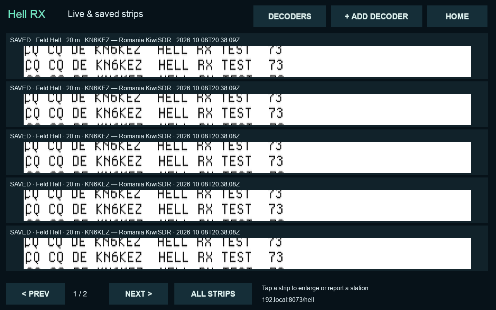
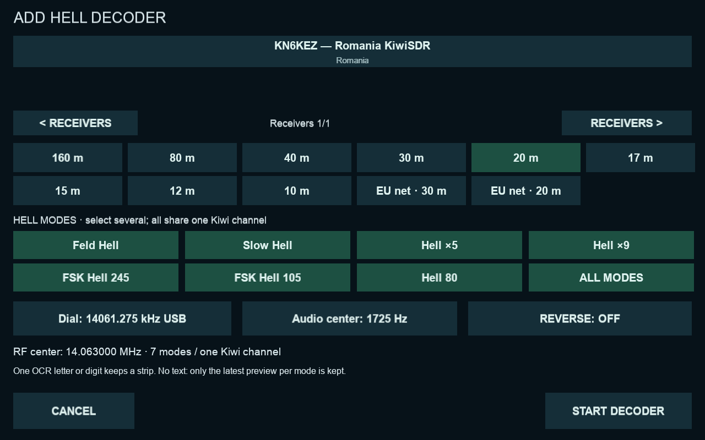

# Hell RX

Open **Digital tools → Hell RX** (or **Modes → HELL RX** on the CM5 PR #12
installation). Choose **Add decoder**, a KiwiSDR receiver, band, one or more Hell variants,
USB dial frequency and audio center. Select **All modes** to run all seven
raster engines on the same audio. Each receiver occupies just **one Kiwi audio
channel**, regardless of the number of selected modes. This covers different
variants at the same RF center; it does not scan other frequencies. Start, Stop, Edit and Remove use the same saved settings on the
touchscreen and the web page at `http://cm5.local:8073/hell`.

Supported variants: Feld Hell, Slow Hell, Hell ×5, Hell ×9, FSK Hell 245,
FSK Hell 105 and Hell 80. This is a headless NumPy receiver based on fldigi's
receive design and timings, rather than a launched fldigi desktop. It uses the
existing NumPy and Pillow dependencies. Tesseract with English recognition data
(`tesseract-ocr` and `tesseract-ocr-eng`) is installed by the dependency script
for optional text triage. No new display or audio driver is used.

## Reading and saving

Hell is an asynchronous facsimile mode. There is **no mode header, automatic
callsign decoding or completion percentage**. Select the actual transmitted
variant and adjust the audio center until text is readable. Reverse swaps ink
and background (useful for reversed FSK). The receiver displays noise too; a
saved strip is not a verified transmission. OCR is a retention aid, never proof of a decode; there is no automatic spot
submission.

The gallery shows the latest raster for each receiver/mode in both interfaces, updates about every two
seconds (the web polls every three), and saves strips every 30 seconds or 768
columns, whichever is sooner. Five wide strips fit the local 1280×800 display.
Tap one to enlarge it; the web viewer also offers PNG download. Receiver cards
have a latest-strip preview. Reception continues when returning to the radio.

Finished strips are checked in one bounded background OCR worker. **A single
recognized ASCII letter or digit is enough to keep a strip**, even without a
word or callsign. A low Tesseract confidence floor of 20/100 excludes
zero-confidence guesses generated from static (this is not a probability). These are labelled **Possible
text**, and may include noise resembling a character. Punctuation alone does
not qualify. OCR is imperfect on weak, drifting Hell rasters; a blank result is
not proof that a transmission was absent.

When OCR finds no text, the latest **preview** for that receiver and mode is
kept and replaces the preceding OCR-negative preview. The **Saved strips** view
retains possible text and unchecked captures. Existing archives are not run
through this filter. OCR errors, missing software, timeouts and overload keep
the original strip as unchecked. Recognition is local; no image is sent to a
cloud service. The web page also has a **Possible text** filter and mode filter.
The latest view shows one image per receiver/mode so empty listening periods do
not fill the preview page. OCR output is only a guess and never auto-fills a
PSK Reporter callsign.

Stop, an audio gap, an edit or disconnect finishes the current strip. Restart
keeps earlier saved strips. The most recent **300** strips are retained across all
Hell receivers, including across application restarts. Download any images you
want to keep permanently. Removing a receiver keeps its saved strips.
Data defaults to `~/.local/share/ituner-sdr/hell` (`ITUNER_HELL_DIR` overrides it).
Up to six Hell receivers can be configured; other radio/WSPR/SSTV connections
share the Kiwi's available channels. A busy Kiwi reports an error; press Start
after a channel becomes free.

## Frequencies

All presets explicitly store USB **dial** frequency and **audio center**:
`RF center Hz = dial kHz × 1000 + audio Hz`. General presets select a point
within the Feld Hell Club's published activity areas. They are starting points,
not dedicated channels or a promise of activity.

| Band / preset | USB dial kHz | Audio Hz | RF center kHz | Default mode |
|---|---:|---:|---:|---|
| 160 m | 1842 | 1500 | 1843.5 | Feld Hell |
| 80 m | 3582.5 | 1500 | 3584 | Feld Hell |
| 40 m | 7083.5 | 1500 | 7085 | Feld Hell |
| 30 m | 10139.5 | 1500 | 10141 | Feld Hell |
| 20 m | 14061.5 | 1500 | 14063 | Feld Hell |
| 17 m | 18098.5 | 1500 | 18100 | Feld Hell |
| 15 m | 21061.5 | 1500 | 21063 | Feld Hell |
| 12 m | 24922.5 | 1500 | 24924 | Feld Hell |
| 10 m | 28061.5 | 1500 | 28063 | Feld Hell |
| EU net 30 m | 10144 | 1500 | 10145.5 | FSK Hell 105 |
| EU net 20 m | 14068 | 1500 | 14069.5 | FSK Hell 105 |

The club lists the Saturday European net at 10:00 UTC: 30 m on odd weeks,
20 m on even weeks. Confirm current announcements and the mode. Selecting
Hell ×9 raises the audio center if necessary to fit its wider bandwidth and
automatically compensates the USB dial to keep the same RF center. Existing
single-mode settings remain single-mode until edited.
The editor permits custom frequencies. The local editor can also copy the
current radio's USB dial.

Sources checked 2026-10-08:
- [Feld Hell Club frequencies](https://sites.google.com/site/feldhellclub/Home/frequencies)
- [Feld Hell Club nets](https://sites.google.com/site/feldhellclub/Home/nets)
- [Hellschreiber operator frequency/mode notes](https://www.hellschreiber.com/hellschreiber-frequencies.htm)
- [fldigi modes](https://www.w1hkj.org/FldigiHelp/feld_hell_page.html)

## Optional PSK Reporter reports

There is no image-upload service integrated here. PSK Reporter accepts station
reception reports for Hell modes. In either enlarged-image view, choose
**Report station** and enter the callsign you can read, the receiving station's
callsign and its antenna's Maidenhead grid. Confirm that the station and location
are correct and that you may report for this receiver. This is per-receiver:
never use your own Bucharest location for a remote Kiwi elsewhere. Previously
entered reporter/grid values are remembered for the same receiver URL; the
confirmation is never preselected.

Nothing is uploaded simply by starting a decoder. Only an explicit confirmed
report is queued. Only images from the last 24 hours can be reported. Duplicate
calls within five minutes for the same source are rejected. The queue holds at
most 100 pending reports and retains an audit of the last 500 submissions.
The web page shows the latest 100 report statuses and lets you cancel queued
reports. No fabricated SNR, OCR text, audio or images are sent.

The worker sends IPFIX/UDP to `report.pskreporter.info:4739` about every five
minutes with randomized scheduling, one receiver identity per packet, a stable
source port and repeated templates. Information source is **manual (3)**; mode
uses current ADIF Hell names. The UTC timestamp and RF center come from the
selected strip. A report refers to the strip's start time (up to 30 seconds
before the station's appearance).

UDP has no delivery acknowledgement: **sent (unconfirmed)** means handed to the
network, not confirmed by PSK Reporter. Failed/ambiguous sends are marked
**uncertain** and never automatically retried; interrupted `sending` records are
also uncertain on restart. Queued reports survive a restart but expire after
24 hours. No synthetic spots should be submitted to the live service for tests.

Protocol: https://pskreporter.info/pskdev.html
ADIF names: https://www.adif.org.uk/317/ADIF_317_annotated.htm

## Implementation and validation

The receive DSP uses complex downconversion, a streaming FIR, envelope detection
for OOK or phase-difference discrimination for FSK, and a free-running 28-pixel
column clock. Two adjacent columns are stacked to preserve readable text across
an arbitrary vertical starting phase. Network gaps reset DSP state and finish
the current strip. There is no automatic frequency tracking or mode detection.

The code follows fldigi `src/feld/feld.cxx` by Dave Freese W1HKJ, with gmfsk
heritage and the contributors credited in `UI/hell_decoder.py`. The adaptation
is GPL-3.0-or-later; the full license is in `licenses/fldigi-GPL-3.txt`, installed
alongside the application. Original source:
https://github.com/w1hkj/fldigi/blob/master/src/feld/feld.cxx

Tests independently modulate all seven variants, compare recovered pixels,
check packet-boundary invariance, reverse, reset, silence, durable strips,
local/web controls, invalid input, HTTP authorization and the PSK IPFIX wire
format/deduplication/uncertain-send rules. Upload tests mock the network.
Known test waveforms establish decode operation; live audio alone does not
prove successful over-the-air Hell reception.

The main application's shared HTTP server remains a LAN interface. No router,
public port-forwarding or KiwiSDR admin settings are changed by this feature.

The example below uses an independently generated test signal, not a claimed
on-air reception:

