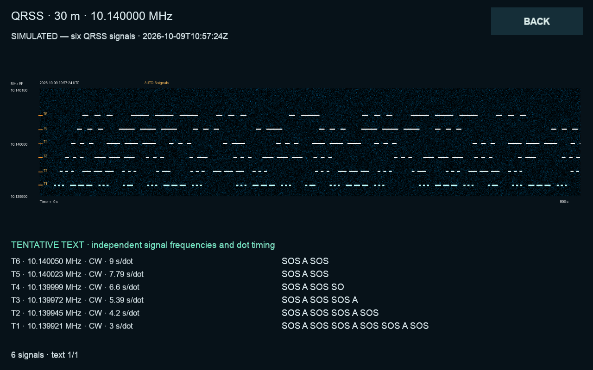

# QRSS: waterfall and tentative Morse text

Open **Digital tools → QRSS** (CM5 PR12: **Modes → QRSS**) or
`http://cm5.local:8073/qrss`. Add a decoder and choose a Kiwi receiver and band.
A single 12 kHz audio connection feeds both outputs; no second receiver slot is
needed for text. Existing WSPR, SSTV and Hell receivers remain independent.

## Automatic acquisition (default for new receivers)

Choose **AUTO** in the receiver editor. It searches the displayed frequency
span for up to **six simultaneous signals**: keyed CW carriers or complementary
FSK tone pairs. Each track estimates its own dot duration from mark/space runs
and tries both FSK polarities. Fast and slow stations can be decoded together. No manual mark
frequency, shift or dot setting is needed. The band/audio center remains the
center of the search window, not necessarily the detected station.

The receiver reports **Searching** until it has enough consistent transitions,
then lists independently acquired tracks with mode, frequency, FSK shift and
estimated seconds per dot.
Allow several characters: slow stations may take minutes. Orange markers label each acquired mark frequency with a track ID. A stronger continuous carrier is not
preferred over a keyed signal. After a signal disappears it searches again.
Each complementary FSK pair owns both tones and is decoded only once. Up to
24 spectral peaks are considered; the best six non-overlapping candidates are
tracked. This is a bounded search, not a promise to decode every visible trace.
Track IDs remain stable as relative signal strengths change and are local to
one uninterrupted receiver stream. Recent faded tracks retain their text;
up to 12 active/recent tracks are held in memory.
Short sequences can leave polarity or speed ambiguous; text stays tentative.
When both FSK polarities fit almost equally well, higher-tone marks are preferred;
stronger timing evidence, such as long word gaps, can override that preference.

A bounded 20-minute spectrum history is revisited approximately every ten
seconds. Morse's 1:3:7 element/gap timing is fitted continuously, including
fractional dot times such as 4.3 seconds. Brief glitches shorter than a quarter
of a fitted dot are filtered separately for each track, without bridging
unknown carrier loss. Buffered observations are replayed
after acquisition. Recent captures from the same uninterrupted stream can gain
text after they were saved; older images from before this software update are
not retrospectively decoded. Audio discontinuities discard the acquisition
history and start a fresh search.

Current search limits are 2–90 seconds per dot and approximately 2–25 Hz FSK
separation (at least 2.5 FFT bins). An overlapping signal, rapid drift, very
narrow FSK shift or weak signal may remain visually readable without an
automatic lock. There is no automatic DFCW/pattern decoder or guaranteed
callsign verification. Manual CW/FSKCW and Visual only remain available.
Existing saved manual configurations are preserved; select AUTO to change one.

The user's reported saved waterfall is a regression fixture: without supplying
its frequency, shift or timing, acquisition finds about 1585 Hz audio,
10 Hz shift and 4.3 s/dot, recovering the repeated tentative string S52AB.
This fixture reconstructs observations from a rendered PNG, not raw RF/audio,
and does not prove a station identity or calibrated sensitivity. A second
fixture contains FFT observations from a 120-second live PCM capture and
checks the tentative fragment AB without supplied tuning or timing.

## Manual receiving and waterfall

- The waterfall covers the selected span, with frequency increasing upwards and
  time running left to right. Tap a capture to enlarge it. The orange center tick
  marks the selected tone.
- For manual text decoding, choose **CW** (on/off keyed) or **FSKCW** (frequency-shifted CW),
  set **3, 6, 10, 30 or 60 seconds per dot**, and tune **Mark tone** to the signal.
  Plain CW ignores Reverse. FSKCW assumes the space tone is below the mark tone
  by the configured shift; Reverse exchanges their interpretation.
- **Selected RF = USB dial × 1000 + audio tone** in Hz. Changing the tone changes
  the tracked RF frequency; compensate the dial if you want the same RF.
- The manual text decoder follows **one selected signal**, not all traces in the span.
  It does not automatically identify speed, callsigns, DFCW or arbitrary beacon
  patterns. Select **Visual only** for those; the image still contains them.
- FSK separation must be resolvable at the selected integration time. The editor
  rejects shifts below 2.5 FFT bins. Slower dots permit narrower shifts.
- Text is **tentative**. Fading, frequency drift, low SNR and overlapping stations
  can produce errors or no text. The detector uses narrow FFT bins; accurate
  tuning matters, especially with 30/60-second dots. Visual traces may remain
  readable below the automatic decoder's threshold. There is no CRC or reliable
  automatic confirmation of a callsign.

Preset RF centers: 80 m 3.500850 MHz, 40 m 7.000850 MHz,
30 m 10.140000 MHz, and 20 m 14.096900 MHz; each defaults to ±100 Hz,
AUTO acquisition and 10-minute captures. Stored manual fallback values are
6 s/dot FSKCW with 5 Hz shift. These are starting areas,
not a guarantee of continuous activity. Manual fallback values do not automatically match
an unknown signal. The 30 m preset is selected initially.

Sources: [QRP Labs 80/40 m QRSS kit](https://qrp-labs.com/qrsskit.html),
[QRP Labs 20/30 m beacon frequencies](https://qrp-labs.com/flights/u4b10.html),
and [QRP Labs mode descriptions](https://www.qrp-labs.com/qrsskitmm.html).

## Galleries and persistence

The 1280 × 800 local gallery displays four captures with tentative text. Web
and local editors control the same saved sessions: Add, Edit, Start, Stop and
Remove. Web views can show all captures, latest per receiver, or captures with
some tentative text. Click an image to enlarge it or download its PNG.
The web gallery uses one full-width spectrogram per row, giving long captures
more horizontal space. Plot and text areas keep stable heights during live
updates; long text scrolls inside its own area. Existing image nodes are reused
and new pixels replace the old only after loading, including in the enlarged
viewer. Receiver controls also update in place. All gallery views hold their
current capture order while polling; use **Show latest captures** when notified
of new arrivals, or change a filter/page, to load the new list. Live pixels and
text still update in the captures already on screen. This preserves the capture
and scroll position being read, including at image rollover. Time and frequency
axes scale independently to fill the plot area. Web cards and the enlarged local view show separate text rows labelled with
track ID, RF frequency and dot timing. The local enlarged view pages through
six text rows at a time. Text from different stations is never joined into one
message. Manual modes and older captures keep their single-text display.

Live images update approximately every five seconds. Choose 5, 10, 20 or 30
minutes per capture. Text timing continues across image boundaries. Audio gaps
close a partial capture and reset the text parser, avoiding invented characters
across a lost connection. Stop saves the partial image and its available text.

Images and their JSON metadata, including tentative text, are saved under
`~/.local/share/ituner-sdr/qrss/images`; `sessions.json` stores receivers and
paused states. Override with `ITUNER_QRSS_DIR`. The newest **300 captures** are
retained, including captures without recognized text. Removing a receiver or
stopping it does not erase its saved captures. Startup recovers interrupted live
captures as saved images. At most six QRSS receivers can be configured, subject
to actual Kiwi slot availability alongside other listeners.

No QRSS uploads or automatic station reports are sent. A visual capture or a
text guess is not treated as a confirmed reception report.

## Implementation, dependencies and attribution

`UI/qrss_decoder.py` adapts the periodic-Hann overlapping FFT approach in
[QrssPiG](https://gitlab.com/hb9fxx/qrsspig), Martin Herren / HB9FXX,
`src/QGProcessor.cpp`, commit `19bb36425053e0d179ddd9a309ed9b169f5858d8`.
Its GPL-3 license is included in `licenses/qrsspig-GPL-3.txt`.
This is a NumPy adaptation, not a bundled QrssPiG executable. Acquisition,
rendering and Morse tracking are integrated iTuner code.
It uses the app's existing NumPy and Pillow dependencies; no new driver,
external decoder executable or model download is needed.

Validation includes independently generated CW/FSKCW with all five dot speeds,
reversed FSK, random chunk boundaries, silence, noise, continuous carrier,
interrupted audio, image rollover, persistent settings/text and shared web/local
controls. Multi-signal tests mix strong FSK, reversed FSK 18 dB weaker and CW
24 dB weaker at 4.3/7.2/12.5 seconds per dot, with a louder continuous carrier.
They also check separate nearby CW signals, track limits, stable IDs, signal
loss, and persistence of independent text through capture rollover. Passing generated-signal tests is not evidence of an on-air station.

The main UI includes QRSS directly. On the existing PR12 CM5 UI, the incremental
compatibility patch is `hardware/cm5/sstv/qrss-ui.patch`, applied after
`hell-ui.patch`. Do not replace the CM5's display/touch/audio configuration.
