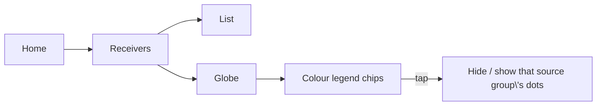

# board_v1 interface and receiver audit

Compared `board_v1` (b12c8dd, main + JD9365DA-H3 + upstream PR 11)
with `lucaiuli/fmdx-support` and `lucaiuli/knob-ui`, including
`19cfe10` (protocol-aware handoffs), `a2f5c64` (mode/sidebar navigation),
`c71268f` (menus), and the baseline FM-DX PR branch.

The PR 11 baseline port did not include all the work on the original fork.
A wholesale merge would also replace newer main functionality, including
OpenWebRX and local receiver integration. This update ports the relevant
behavior while retaining those newer paths.

## Corrected here

- Home instruments no longer render over Settings, Modes, or option drawers.
  Drawers cover the entire rail with an opaque background.
- Settings, Modes, Receivers, Network, Font Lab, local SDR, and expanded WSPR
  views use the same bottom-right Back target and arrow renderer as the
  existing Audio, Display, Filter, Apps, and Constellation drawers.
- Home mode buttons commit the selected demodulator before opening options.
  FM-DX keeps its server-controlled FM mode; local SDR validates supported modes.
- KIWI is the fresh-install and Reset Display waterfall palette. Existing
  saved palette choices are preserved.
- FM-DX waterfall rows retain their FM carrier coordinates rather than being
  clipped against Kiwi's 29.999 MHz display boundary. This is an audio-derived
  spectrum/waterfall, not a wideband RF spectrum supplied by the FM tuner.
- Kiwi receiver handoffs restore mode-specific strong-signal landing from
  19cfe10. Noise-only data times out after two connected seconds. Manual tuning,
  mode changes, and a replacement receiver invalidate the pending landing.
- FM-DX handoffs select the nearest cached station when available. RDS names
  continue to accumulate passively from live status and are persisted.
- The explicit FM-DX Scan command covers the entire supported FM band rather
  than only a capped group of presets. Stop restores the origin. Manual tuning
  and receiver changes take ownership so late scan work cannot retune them.

## Sidebar follow-up

All option rails use a shared screen-name header. FM-DX status, station
navigation, Scan/Stop, and tuning controls occupy separate rows. Manual FM-DX
tuning offers 50, 100 (default), and 200 kHz steps, saved independently from
Kiwi's step. FM dragging uses channel-sized detents rather than the audio
waterfall span. The RDS band scan retains its independent 100 kHz increment.

Settings no longer duplicates the receiver directory as KIWI. SYSTEM is now
the clearer INFO destination with its own icon. STATS has an explicit Close
target and its launcher toggles the graph. MODES opens the complete mode-family
and tuning drawer directly; WSPR remains available in that same drawer.

## Branch features not silently imported

The original fork also has a richer FM-DX audio scope/ruler, station shortcut
presentation, scan-progress presentation, and broader receiver-picker/map
refactoring. The knob branches have the separate three-knob input/controller,
focus navigation, and desktop knob simulation. Those are distinct feature
ports, not included wholesale in this CM5 bug-fix pass. CAD commits on the
local knob branch do not affect the runtime UI.

RDS discovery in the completed original implementation was passive during
listening, with an operator-started cancellable scan. It was not an automatic
background band sweep: sweeping retunes the shared FM-DX receiver and mutes
listening. This distinction is retained.

## Verification

Regression tests cover navigation spacing and shared Back rendering, hidden
compact readouts, immediate mode engagement, actual waterfall texture-strip
mapping above 30 MHz, and generation-safe landing/scan behavior. OpenGL renders
at the CM5's 1280x800 logical resolution are inspected for sidebar layout.
Physical touch and live server behavior still require a CM5 trial before PR.

## Unified receiver browser and capability contract

The receiver directory is one catalog rather than separate list and map paths.
`UI/receiver_catalog.py` defines a protocol-neutral `ReceiverRecord` and a
`ReceiverCapabilities` contract; KiwiSDR, OpenWebRX, local devices, and FM-DX
all feed one collection. A receiver's transport (`protocol`) is kept separate
from its browser segment (`source_group`), so a LAN Kiwi is `protocol="kiwi"`
but appears under `LOCAL` and never enters the USB local-device worker.

Source segments are ordered `KIWI`, `OPENWEBRX`, `LOCAL`, `FM-DX`, `ALL` and
render as one single-select row across the top of the 1024 px content canvas.
The right rail keeps only global commands: the `MAP` toggle, `SEARCH`, `SORT`,
`FAVORITES`, and `BACK`. Opening Receivers selects `KIWI`, and the `ALL` view
always sorts Kiwi first, OpenWebRX second, Local third, and FM-DX last. The list
and map views read the same filtered record collection so a source filter,
query, sort, favorites toggle, and selected receiver survive switching views.

Every radio and waterfall control is checked against the active capability
contract. Controls stay visible across receiver types; a fixed or unsupported
control renders disabled and explains itself when pressed instead of silently
ignoring input. Waterfall captions distinguish an RF waterfall from FM-DX's
derived audio spectrum.

### Shared FM-DX tuner

FM-DX servers are shared: changing the frequency changes the station for every
connected listener. iTuner therefore listens read-only by default. It does not
send a tune command on connect, does not expose band scan, and does not send a
frequency command while read-only. Shared frequency control requires an
explicit acknowledgement for the active server, held only in memory for that
session; leaving the server or restarting the app always returns to read-only.
The acknowledgement is never persisted.

Product rules, verbatim:

```text
KiwiSDR is the default and most complete receiver type. OpenWebRX uses the
same browser and adapts controls to the active server profile. Local receivers
show only controls implemented by the connected hardware. FM-DX servers use a
shared tuner: iTuner listens without retuning by default, and any shared
frequency control requires an explicit acknowledgement for that session.
```

### Implementation status

The catalog, capability contract, source-segment header, protocol-aware health
records, persisted stable receiver identity (`receiver_id`/`protocol`, version 4
with legacy `receiver_type` migration), `OpenWebRxSession.negotiated_capabilities()`,
and the session-only `FmdxControlPolicy` are implemented and covered by the UI
test suite. The FM-DX drawer is read-only by default: it shows the shared-tuner
explanation and a single `ENABLE SHARED CONTROL` action, presents the
session-only confirmation, omits band scan entirely, hides the tuning step
while read-only, and never sends a tune command on connect. Leaving the drawer
or switching receivers revokes the acknowledgement, so a fresh launch always
starts read-only.

The receivers Globe draws every server as a single filled disc coloured by its
source group (Kiwi, OpenWebRX, Local, FM-DX) with a matching colour legend.
Tapping a legend chip toggles that group: its dots disappear from the globe and
leave the tap/hover surface until the chip is tapped again (session-only).



The browser only returns to the main screen after a real receiver change:
re-selecting the already-live endpoint (and switching source while a pick is
still settling) keeps the browser open, so the LOCAL tab no longer dismisses
itself under the operator. An empty source shows the shared
`NO RECEIVERS IN THIS SOURCE` text instead of a blank list.

The remaining work is the renderer pass that routes the Home mode, passband,
frequency, and waterfall controls through `decide()` notices and replaces the
remaining split map/list state (`picker_map_open`, the `DIRECT`/`PROXY` route
badges, and the fixed OpenWebRX test restore) with the shared browser state.
