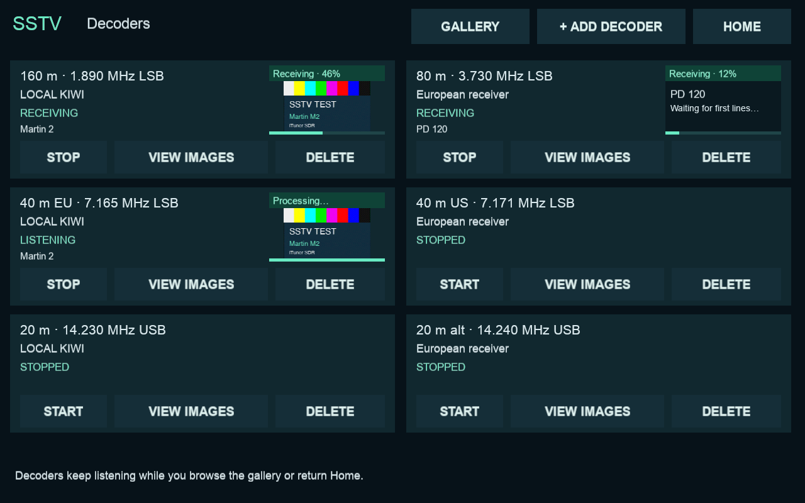

# SSTV decoders and image galleries

Open **Digital tools → SSTV → Add decoder**. Select a Kiwi receiver and a
frequency, then **Start decoder**. Open **Decoders** for Start/Stop, Delete and
View images on each receiver card. Home returns to the radio while decoding continues. Removing a decoder keeps its
saved images. At most six decoders can run, each consuming one receiver audio
slot. WSPR and the main radio consume their own slots too.

The local gallery is drawn at the existing **1280 × 800 logical resolution**
(the physical 800 × 1280 panel is rotated by the existing display setup).
It shows **15 images per page in a compact 5 × 3 grid**, using the full screen
width. Receiver cards are on the separate **Decoders** page. Choose View images
on a decoder to filter its images, All images to clear the filter, or tap any
image to enlarge it.
Images retain their aspect ratio; display/touch drivers and orientation are
unchanged.



The LAN gallery is available at **http://cm5.local:8073/sstv** (or the
hostname/IP of the machine running the app). It uses the same images and
metadata as the local gallery, refreshes every five seconds, and provides
enlarged viewing and PNG downloads. Both gallery images and the small receiver
previews are clickable; the viewer scales the image to fit the screen without
changing its aspect ratio. Use **Add decoder** to choose a KiwiSDR receiver and band, or **Edit receiver /
band** to change an existing decoder. **Start**, **Stop** and **Remove decoder**
use the same saved state as the touchscreen. The picker includes receiver
search by name, location or address and the same band presets as the local UI.
Edits preserve the running/stopped state; new decoders can start immediately
or be saved stopped.
Stopping a decoder releases its receiver connection; saved images remain.
The receiver filter only changes which images the browser shows.

The companion **http://cm5.local:8073/wspr** page shows WSPR receiver status,
two-minute capture progress, and up to 96 recent spots per receiver, with a
receiver filter and the same Add/Edit/Start/Stop/Remove controls. Both pages
link to one another. On the touchscreen, use SSTV → Decoders → Edit to select
a different receiver or band; WSPR retains its existing per-receiver settings.

These controls are for a trusted LAN: there is no login. POST requests require
a per-process token and same-origin browser requests, and execute on the UI
thread rather than mutating receiver state from HTTP workers. This prevents
cross-site form controls but is not user authentication. Do not expose this
port directly to the Internet.


## Modes and frequency presets

Automatic detection now covers **48 analog SSTV modes**:

- Martin M1/M2/M3/M4; Scottie S1/S2/S3/S4/DX.
- Robot 24/36/72 colour and 8/12/24/36 B/W.
- PD50/90/120/160/180/240/290.
- Pasokon P3/P5/P7 and Wraase SC2-60/120/180.
- MMSSTV MP73/115/140/175, MR73/90/115/140/175, ML180/240/280/320.
- Narrowband MP73-N/110-N/140-N and MC110-N/140-N/180-N.

A valid standard, extended, or narrowband VIS header is required. Leaders,
VIS tones, standard parity/stop bits and narrowband checksums are validated
before reporting a mode; a noise candidate does not mean a real unsupported
transmission was received. An unsupported valid header is reported while
listening continues. Joining halfway through a picture waits for the next header.
This is not universal support: AVT, Robot 12 colour, legacy Wraase SC1,
proprietary variants, fax and EasyPal/DRM digital pictures remain unsupported.

Mode timing references:
- [MMSSTV author's mode specifications](https://github.com/n5ac/mmsstv/blob/8060b5f1e9727b0052d74108081c6db7b26babad/mode.txt),
  with [implementation timing](https://github.com/n5ac/mmsstv/blob/8060b5f1e9727b0052d74108081c6db7b26babad/sstv.cpp)
  for MC110-N (140 ms scans; the prose's 143 ms is inconsistent).
- [QSSTV mode table](https://github.com/ON4QZ/QSSTV/blob/8c27d6d169d8c6c197eb47c2089870e39bc06a02/src/sstv/sstvparam.cpp).
- [Independent PySSTV encoder](https://github.com/dnet/pysstv).

| Band/preset | Dial frequency, MHz | Mode |
| --- | ---: | --- |
| 160 m | 1.890 | LSB |
| 80 m | 3.730 | LSB |
| 40 m Europe | 7.165 | LSB |
| 40 m US | 7.171 | LSB |
| 20 m | 14.230 | USB |
| 20 m alternate | 14.240 | USB |
| 17 m | 18.117 | USB |
| 15 m | 21.340 | USB |
| 12 m | 24.940 | USB |
| 10 m | 28.680 | USB |

These are starting points for receiving, not an exclusive or universal band
plan. Regional activity differs. The less-used WARC frequencies are activity
suggestions, not standardized calling channels. For another frequency, first
tune the main radio in USB or LSB, then choose **Use current radio dial** in
Add decoder. This also permits region-specific choices on 60 m. Narrowband modes can use a custom dial; no 30 m calling-frequency preset is assumed. VHF/UHF
presets are excluded because this integration uses Kiwi's 0–30 MHz range;
it cannot receive ISS SSTV at 145.800 MHz.

Sources used for presets:
- [IARU Region 1 band plan](https://www.iaru-r1.org/wp-content/uploads/2019/08/hf_r1_bandplan.pdf):
  Romania uses Region 1; 7.165 MHz is its 40 m image activity centre versus
  ARRL's US 7.171 MHz. These are activity conventions, not different codecs.
- [ARRL band plan](https://www.arrl.org/band-plan): 7.171 and 14.230 MHz.
- [Russian Digital Radio Club SSTV operating guide](https://www.rdrclub.ru/sstv):
  common European 80/40/20/15/10 m activity frequencies.
- [PA8S operating reference](https://www.pa8s.nl/knowledge-base/frequencies-for-sstv/):
  160 m, 20 m alternate, 17 m and 12 m activity suggestions.

## Storage, lifecycle and web configuration

Session configuration and images live in `~/.local/share/ituner-sdr/sstv/` for
the application user. The newest 300 image records are kept. Each capture has
one ID, so a partial preview is replaced by its completed image. A **Receiving** tile appears immediately after a valid header, with progress
on both the 15-tile gallery and the decoder card. Before the first pixels are
ready it shows a placeholder; a first preview is attempted after 10 seconds,
then every 30 seconds. At the end it says **Processing** until the final PNG
is published. The web gallery and receiver cards show the same live state.
A stopped or disconnected capture loses its live badge; an already saved
partial remains available. In-progress tiles are transient and never become
fake saved images. They are merged with their previews by capture ID. Poor/noise-like images are rejected using P4's
adjacent-row correlation threshold (0.08); weak or flat images may be rejected.
PNG files and JSON sidecars are written atomically. No audio recordings are
retained after image processing.

Saved running sessions resume after a 35-second settling delay, staggered by
12 seconds. Stopped sessions stay stopped. Network outages reconnect with
backoff; a busy/password-protected receiver stands down until Start is pressed.
Packet sequence gaps discard incomplete audio so separate stretches of a
transmission are not silently spliced together. Scottie DX capture extends
beyond four minutes rather than being truncated by P4's old 140-second buffer.
One low-priority image-decoding subprocess runs at a time with a 90-second
limit; complete images take priority over partial previews in a bounded queue.

Optional environment variables in the application's service configuration:

- `ITUNER_SSTV_DIR`: override the data directory.
- `ITUNER_SSTV_PORT`: HTTP port, default `8073`; negative disables HTTP.
- `ITUNER_SSTV_BIND`: listening address, default `0.0.0.0`; use `127.0.0.1`
  for access only through a local reverse proxy.

The shared web server starts with the app, even without saved sessions. A port
conflict is shown in the local gallery; change the port and restart the app.
The server ends when the SDR app exits.

## Installation and dependencies

SSTV requires only the app's existing **NumPy and Pillow** dependencies. The
small upstream decoder is included under `UI/sstv_vendor/`, pinned to
`colaclanth/sstv` revision `3e556eee8ad4c4425799cb652bac26ee58f8e113`, with its
GPLv3 license and source notice. Its unused CLI, SoundFile and SciPy dependencies
are omitted: WAV loading uses the standard library, and windowing uses NumPy.
The integration improves the short-window frequency estimate with zero padding
and quadratic peak interpolation, verified against an independent encoder.

Both existing installers copy the SSTV files. For CM5, use the existing
**`--cm5-existing-display`** installation path; no display-driver dependency has
been added. The legacy installer still explicitly installs its original
ST7701 driver when selected and must not be used on this CM5.

Validation (Python 3.13, matching the app runtime):

```sh
python3 -m unittest discover -s tests -v
```

For the independent waveform round trips (including PD, Pasokon, Wraase and B/W), also install
`PySSTV==0.5.7` in a development environment. This is a **test-only encoder**;
it is not required on the Pi. The test suite otherwise skips those round-trip
tests explicitly. Additional MMSSTV image fixtures follow the author's published
protocol. Tests cover live placeholders, progress, completion, interrupted
captures, filtering, VIS/parity/checksums, all supported headers across packet
boundaries, sequential frames, long modes, queue/subprocess publication,
receiver PCM byte order and gaps, stop, persisted sessions/images, retention,
and HTTP image/API/path validation. Local OpenGL views and browser image
opening were also exercised with generated fixtures. Real over-the-air
reception still needs a suitable signal. The new on-device suite passed with
17 tests and two optional encoder skips; a separately generated PD120
waveform was also used for the CM5 decoding check. The development suite
passed all 19 SSTV tests plus 13 existing audio/bootstrap tests.

## CM5 deployment with PR #12

The current CM5 combines this feature with PR #12. On that build, open
**Modes → SSTV**, beside WSPR. See the [recorded compatibility patch and
deployment checks](../hardware/cm5/sstv/README.md) before reinstalling from
main, so the newer PR #12 features are retained.
