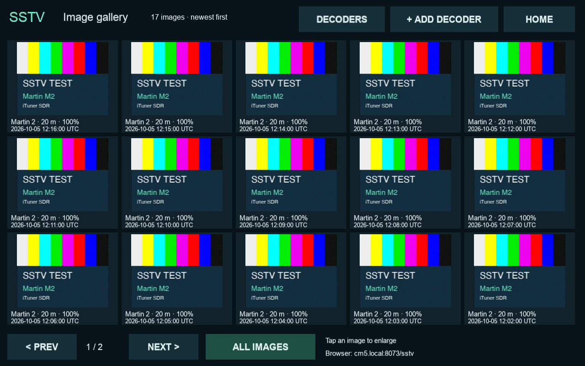

# SSTV decoders and image galleries

Open **Digital tools → SSTV → Add decoder**. Select a Kiwi receiver and a
frequency, then **Start decoder**. Open **Decoders** for Start/Stop, Delete and
View images on each receiver card. Home returns to the radio while decoding continues. Removing a decoder keeps its
saved images. At most six decoders can run, each consuming one receiver audio
slot. WSPR and the main radio consume their own slots too.

The local gallery is drawn at the existing **1280 × 800 logical resolution**
(the physical 800 × 1280 panel is rotated by the existing display setup).
It shows **15 images per page in a compact 5 × 3 grid**, using the full screen
width. Receiver cards are on the separate **Decoders** page. Choose View images
on a decoder to filter its images, All images to clear the filter, or tap any
image to enlarge it.
Images retain their aspect ratio; display/touch drivers and orientation are
unchanged.

A read-only gallery is available on the LAN at **http://cm5.local:8073/sstv**
(or the hostname/IP of the machine running the app). It uses the same PNG
images and metadata as the local gallery, refreshes every five seconds, and
provides full-size viewing and PNG downloads. Receiver selection is local to
each browser; it does not retune the hardware. This endpoint has no remote
radio controls or authentication and is intended for the local network.
Do not expose it directly to the Internet.



## Modes and frequency presets

Supported: **Martin M1/M2, Scottie S1/S2/DX, Robot 36/72**. These are the trusted
modes in the earlier P4 `ft8hub_decode_sstv_daemon.py`. A valid VIS header is
required. Unsupported VIS codes are reported rather than guessed. PD modes,
MMSSTV extended/narrowband modes and EasyPal digital pictures are not decoded.
A receiver joining halfway through a picture waits for the next header.

| Band/preset | Dial frequency, MHz | Mode |
| --- | ---: | --- |
| 160 m | 1.890 | LSB |
| 80 m | 3.730 | LSB |
| 40 m Europe | 7.165 | LSB |
| 40 m US | 7.171 | LSB |
| 20 m | 14.230 | USB |
| 20 m alternate | 14.240 | USB |
| 17 m | 18.117 | USB |
| 15 m | 21.340 | USB |
| 12 m | 24.940 | USB |
| 10 m | 28.680 | USB |

These are starting points for receiving, not an exclusive or universal band
plan. Regional activity differs. The less-used WARC frequencies are activity
suggestions, not standardized calling channels. For another frequency, first
tune the main radio in USB or LSB, then choose **Use current radio dial** in
Add decoder. This also permits region-specific choices on 60 m. There is no
30 m preset because its narrowband SSTV modes are unsupported here. VHF/UHF
presets are excluded because this integration uses Kiwi's 0–30 MHz range;
it cannot receive ISS SSTV at 145.800 MHz.

Sources used for presets:
- [ARRL band plan](https://www.arrl.org/band-plan): 7.171 and 14.230 MHz.
- [Russian Digital Radio Club SSTV operating guide](https://www.rdrclub.ru/sstv):
  common European 80/40/20/15/10 m activity frequencies.
- [PA8S operating reference](https://www.pa8s.nl/knowledge-base/frequencies-for-sstv/):
  160 m, 20 m alternate, 17 m and 12 m activity suggestions.

## Storage, lifecycle and web configuration

Session configuration and images live in `~/.local/share/ituner-sdr/sstv/` for
the application user. The newest 300 image records are kept. Each capture has
one ID, so a partial preview is replaced by its completed image. Partials are
attempted every 30 seconds. Poor/noise-like images are rejected using P4's
adjacent-row correlation threshold (0.08); weak or flat images may be rejected.
PNG files and JSON sidecars are written atomically. No audio recordings are
retained after image processing.

Saved running sessions resume after a 35-second settling delay, staggered by
12 seconds. Stopped sessions stay stopped. Network outages reconnect with
backoff; a busy/password-protected receiver stands down until Start is pressed.
Packet sequence gaps discard incomplete audio so separate stretches of a
transmission are not silently spliced together. Scottie DX capture extends
beyond four minutes rather than being truncated by P4's old 140-second buffer.
One low-priority image-decoding subprocess runs at a time with a 90-second
limit; complete images take priority over partial previews in a bounded queue.

Optional environment variables in the application's service configuration:

- `ITUNER_SSTV_DIR`: override the data directory.
- `ITUNER_SSTV_PORT`: HTTP port, default `8073`; negative disables HTTP.
- `ITUNER_SSTV_BIND`: listening address, default `0.0.0.0`; use `127.0.0.1`
  for access only through a local reverse proxy.

The web server starts when SSTV is opened, or at startup when saved sessions
or images exist. A port conflict is shown in the local gallery; change the
port and restart the app. The server ends when the SDR app exits.

## Installation and dependencies

SSTV requires only the app's existing **NumPy and Pillow** dependencies. The
small upstream decoder is included under `UI/sstv_vendor/`, pinned to
`colaclanth/sstv` revision `3e556eee8ad4c4425799cb652bac26ee58f8e113`, with its
GPLv3 license and source notice. Its unused CLI, SoundFile and SciPy dependencies
are omitted: WAV loading uses the standard library, and windowing uses NumPy.
The integration improves the short-window frequency estimate with zero padding
and quadratic peak interpolation, verified against an independent encoder.

Both existing installers copy the SSTV files. For CM5, use the existing
**`--cm5-existing-display`** installation path; no display-driver dependency has
been added. The legacy installer still explicitly installs its original
ST7701 driver when selected and must not be used on this CM5.

Validation (Python 3.13, matching the app runtime):

```sh
python3 -m unittest discover -s tests -v
```

For the independent Martin M2 / Robot 36 waveform round trips, also install
`PySSTV==0.5.7` in a development environment. This is a **test-only encoder**;
it is not required on the Pi. The test suite otherwise skips that round-trip
test explicitly. Tests cover VIS/parity, all supported headers across packet
boundaries, sequential frames, long modes, queue/subprocess publication,
receiver PCM byte order and gaps, stop, persisted sessions/images, retention,
and HTTP image/API/path validation. Local OpenGL views and browser image
opening were also exercised with generated fixtures. Real over-the-air
reception and performance on CM5 still require on-device validation.
